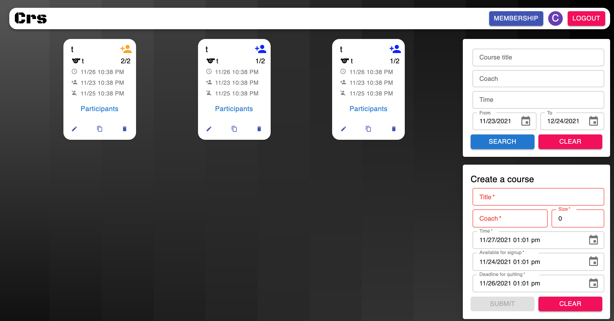

# Crs 
### a multi-user platform for gym course-related actions
### https://crs-course-web-app.netlify.app/

## Running the app

### server folder

To set up heroko postgres database, please see `database instruction.sql` file.

This repo includes an `env.example` file that contains important environment variables for reference.  Make sure to create a `.env` file and include all variables found in the `env.example` file, replacing the example values with those specific to your environment/needs.

To run locally, `npm install`, then `node index.js`

### client folder

This repo includes an `env.example` file that contains important environment variables for reference.  Make sure to create a `.env` file and include all variables found in the `env.example` file, replacing the example values with those specific to your environment/needs.

To run locally, `npm install`, then `npm run start`
